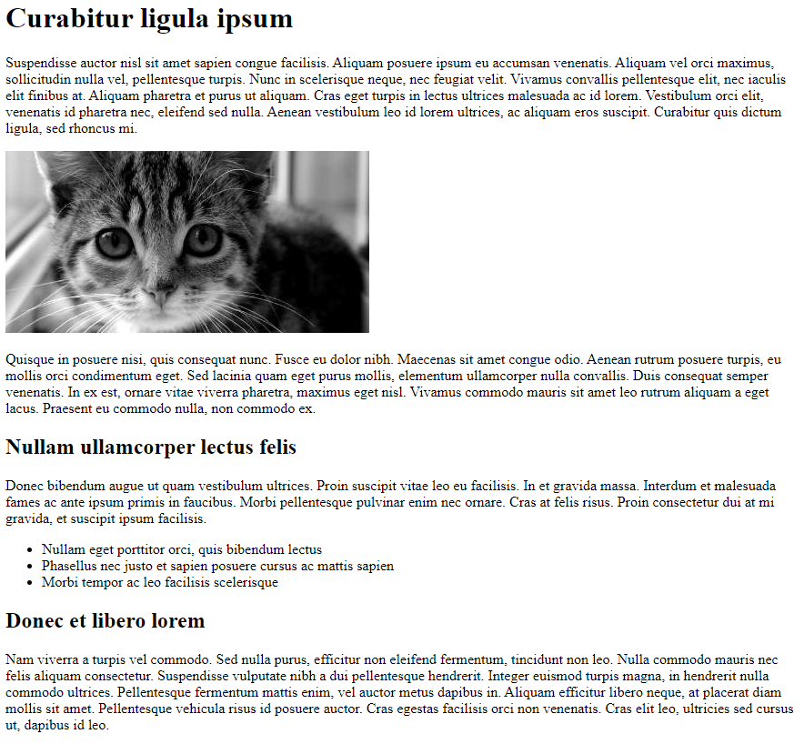

# HTML-sivun toteuttaminen

Tässä tehtävässä harjoitellaan HTML-elementtien käyttöä.
Tuota tehtava.html-tiedostoon HTML-sivu, joka toteuttaa seuraavat asiat:

 * sivulla on dokumentin otsikko (title)
 * sivulla on päätason otsikko (h1)
 * sivulla on vähintään kaksi h2-tason otsikkoa
 * sivulla on vähintään neljä tekstikappaletta
 * sivulla on vähintään kolmen kohdan lista (ul)
 * sivulla on vähintään yksi kuva

Sivun tekstit ja kuvan saat valita vapaasti. Voit käyttää apuna tekstigeneraattoria, kuten [lipsum.comia](https://lipsum.com/). Esimerkin kuva löytyy osoitteesta [http://placekitten.com/g/400/200](http://placekitten.com/g/400/200).

Voit testata täyttääkö tekemäsi HTML-sivu vaaditut kriteerit komennolla

```
npm test
```

Alla on esimerkki sivusta, joka täyttää vaaditut kriteerit.

